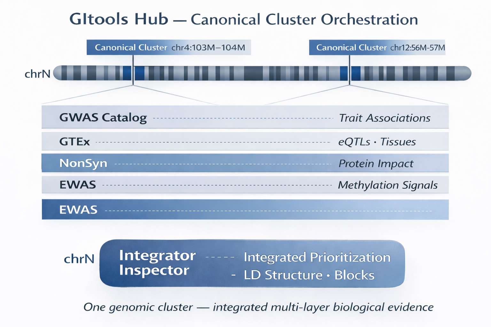

# GItools — Genomic Inspector Tools


**GItools** is a suite of R/Shiny applications for interactive genomic exploration and multi-omics integration.  
All tools follow a shared **canonical, cluster-centric workflow**: starting from genomic hits, defining intervals, merging them into clusters, and assigning multiple layers of biological evidence to those clusters for interpretation, prioritization, and export.

---

## Architecture overview

<p align="center">
  
</p>

> **One genomic cluster — multiple biological layers**

GItools is built around the concept of **canonical genomic clusters**.  
A cluster is defined once (chromosome, start, end) and propagated across specialized inspector applications, enabling consistent and reproducible interpretation of the same genomic signal across multiple biological contexts.

Clusters and navigation across tools are orchestrated by the **GItools Hub**, which provides deep linking and synchronized exploration.

---

## Core philosophy: the canonical path

Across all GItools applications, the workflow is intentionally consistent.

### 1. Input hits
- GWAS hits (SNPs with p-values, −log10(p), rsID, genomic position)
- EWAS results (CpGs or bins with statistics and metadata)
- Prioritized variants (e.g. NonSyn / dbNSFP-derived annotations)

### 2. Threshold / selection
- Filter by p-value, FDR, −log10(FDR), or module-specific criteria  
- The selected threshold defines the **active hit set**

### 3. Build intervals
- Create genomic intervals per hit (e.g. hit ± flank)  
- Or window-based intervals

### 4. Merge intervals into clusters
- Overlapping intervals are merged into **candidate genomic clusters**
- Each cluster has stable identifiers and coordinates:
  - `cluster_id`
  - `chr`
  - `start_bp`
  - `end_bp`
  - summary metrics (counts, scores)

### 5. Assign evidence per cluster
Intersect and map items falling inside each cluster:
- GWAS Catalog associations
- GTEx eQTLs and tissues
- EWAS CpGs or bins
- NonSyn variants and functional annotations
- LD structure and haplotype blocks

### 6. Visualization and export
- Interactive plots (Plotly) and tables (DT)
- Structured exports (CSV / TSV / RDS / ZIP)
- Filenames encode **mode + threshold + timestamp**

> **Design principle**  
> Changing a threshold does *not* silently create or modify clusters.  
> Interval building and clustering are explicit steps, preserving traceability and reproducibility.

---

## Included tools

### Catalog Inspector
Connects GWAS hits with evidence from the GWAS Catalog.

**Pipeline**
threshold → intervals → clusters → map GWAS Catalog entries


**Outputs**
- Cluster summary (`n_catalog`)
- Detailed Catalog tables (traits, rsIDs, studies)
- Structured exports

---

### GTEx eQTL Inspector
Links GWAS hits to GTEx eQTLs for tissue-aware functional interpretation.

**Pipeline**
threshold → intervals → clusters → map eQTLs per cluster


**Outputs**
- Cluster summary (`n_gtex`)
- eQTL / gene tables (tissue, gene, variant, statistics)
- Aggregated and per-cluster exports

---

### EWAS Tumor Inspector
Tumor vs control (or adjacent normal) methylation analysis.

**Pipeline**
group definition → statistical testing → FDR → regional exploration


**Outputs**
- Genome-wide and regional summaries
- Tables and plots by chromosome, window, or cluster
- Validation-ready exports

---

### EWAS Disease Inspector
Disease-focused EWAS exploration using the same region-centric logic.

**Pipeline**
filter by disease → threshold → map hits to regions/windows


**Outputs**
- Disease-specific tables and plots
- Reproducible exports

---

### NonSyn Inspector
Prioritization of nonsynonymous and functionally relevant variants.

**Pipeline**
threshold → intervals → clusters → map NonSyn variants + annotations


**Outputs**
- Cluster summary (`n_nonsyn`)
- Detailed variant annotations (HGVSc/HGVSp, MANE, canonical flags)
- Reporting-ready exports

---

### LD Inspector
Exploration of linkage disequilibrium and haplotype structure.

**Outputs**
- LD matrices and blocks
- Regional LD visualization aligned to clusters

---

## Shared UI / UX patterns

- **Interactive tables (DT)**  
  Column filters, row selection, plot cross-highlighting

- **Interactive plots (Plotly)**  
  Manhattan-style views, interval/cluster tracks, regional zoom

- **Traceability**  
  On-screen logs for data loading and heavy operations

- **Large data handling**  
  Per-chromosome storage, `.rda` preloading, configurable resource paths

---

## Repository layout (typical)

app.R
R/
modules/
helpers/
www/
icons/
css/
example_files/


(Exact structure may vary across inspectors.)

---

## Run locally

1. Clone the repository
2. Open the project in RStudio
3. Install required CRAN / Bioconductor dependencies
4. Run:

```r
shiny::runApp()
Some inspectors rely on GB-scale external resources.
For these, running GItools on a local VM or Shiny Server is recommended.

Data sources and licensing
GItools provides the analysis framework only.
External datasets (GWAS Catalog, GTEx, dbNSFP, EWAS cohorts, etc.) have their own licenses and citation requirements.
Users are responsible for compliance with the relevant terms.

Project goal
GItools accelerates genomic interpretation by converting lists of hits into candidate genomic regions and attaching multiple layers of biological evidence in a consistent, reproducible, and exportable way — supporting prioritization and downstream functional follow-up.
