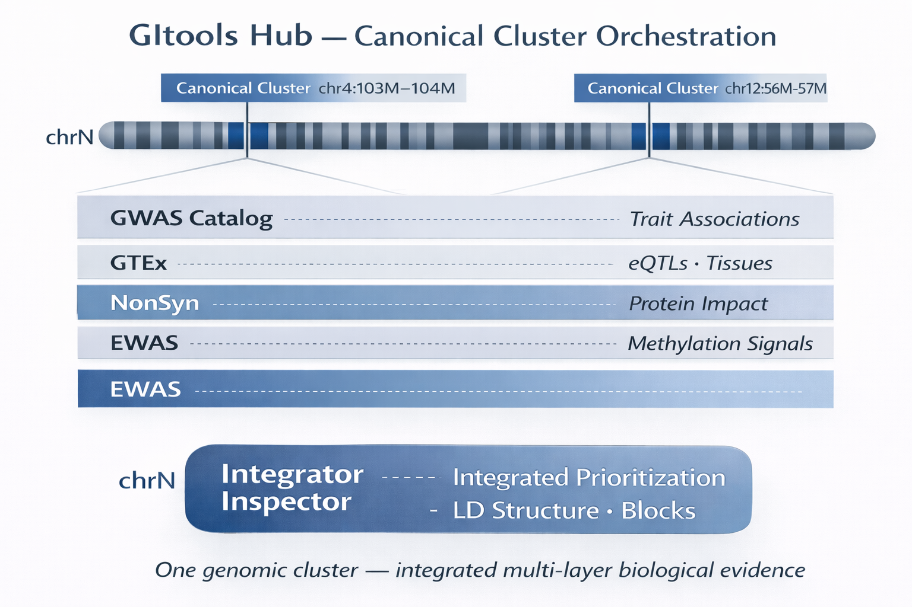

# GItools — Genomic Inspector Tools


**GItools** is a suite of R/Shiny applications for interactive genomic exploration and multi-omics integration.  
All tools follow a shared **canonical, cluster-centric workflow**: starting from genomic hits, defining intervals, merging them into clusters, and assigning multiple layers of biological evidence to those clusters for interpretation, prioritization, and export.

---

## Architecture overview

<p align="center">
  
</p>

> **One genomic cluster — multiple biological layers — one integrative view**

GItools is built around the concept of **canonical genomic clusters**.  
A cluster is defined once (chromosome, start, end) and propagated across specialized inspector applications, enabling consistent and reproducible interpretation of the same genomic signal across multiple biological contexts.

Clusters and navigation across tools are orchestrated by the **GItools Hub**, which provides deep linking and synchronized exploration.

---

## Core philosophy: the canonical path

Across all GItools applications, the workflow is intentionally consistent.

### 1. Input hits
- GWAS hits (SNPs with p-values, −log10(p), rsID, genomic position)
- EWAS results (CpGs or bins with statistics and metadata)
- Prioritized variants (e.g., NonSyn / dbNSFP-derived annotations)

### 2. Threshold / selection
- Filter by p-value, FDR, −log10(FDR), or module-specific criteria  
- The selected threshold defines the **active hit set**

### 3. Build intervals
- Create genomic intervals per hit (e.g., hit ± flank)  
- Or window-based intervals

### 4. Merge intervals into clusters
- Overlapping intervals are merged into **candidate genomic clusters**
- Each cluster has stable identifiers and coordinates:
  - `cluster_id`
  - `chr`
  - `start_bp`
  - `end_bp`

### 5. Assign evidence per cluster
Each inspector contributes a **layer of biological evidence**:
- GWAS Catalog associations
- GTEx eQTLs
- EWAS signals
- NonSyn functional variants

### 6. Integrate and prioritize (Integrator Inspector)
All evidence layers are combined into a unified prioritization framework:
- Cluster-level prioritization
- Block-level (LD-aware) context
- Gene-level scoring based on multi-source support

### 7. Visualization and export
- Interactive plots (Plotly) and tables (DT)
- Structured exports (CSV / TSV / RDS / ZIP)

> **Design principle**  
> Clusters are built once and reused across all inspectors and the Integrator.  
> No hidden recomputation — full traceability and reproducibility.

---

## Included tools

### GItools Hub
The Hub is the entry point to orchestrate and synchronize all inspectors.

**Features**
- Launch and monitor inspectors
- Deep links between apps (cluster → app → region)
- Shared canonical state and cluster propagation

---

### Catalog Inspector
Connects GWAS hits with evidence from the GWAS Catalog.

=======
The Hub orchestrates the full workflow.

**Recommended usage flow**
1. Build clusters in **Catalog Inspector**
2. Enrich clusters with additional evidence using other inspectors
3. Perform final prioritization in **Integrator Inspector**

**Features**
- Launch and monitor inspectors
- Deep links between apps
- Shared canonical cluster state

---

### Catalog Inspector
Defines the **canonical clusters** from GWAS hits.

**Pipeline**  
threshold → intervals → clusters → map GWAS Catalog entries

**Outputs**
- Cluster definitions (canonical)
- GWAS evidence per cluster
- Exportable cluster master tables

---

### GTEx eQTL Inspector
Links GWAS hits to GTEx eQTLs for tissue-aware functional interpretation.

**Pipeline**  
threshold → intervals → clusters → map eQTLs per cluster
=======
Adds **functional (expression-based) evidence**.

**Outputs**
- eQTL–gene associations per cluster
- Tissue-aware interpretation

---

### EWAS Tumor Inspector
Tumor vs control (or adjacent normal) methylation analysis.

**Pipeline**  
group definition → statistical testing → FDR → regional exploration

**Outputs**
- Genome-wide and regional summaries
- Tables and plots by chromosome, window, or cluster
- Validation-ready exports
=======
Epigenetic alterations in tumor contexts.

---

### EWAS Disease Inspector
Disease-focused EWAS exploration using the same region-centric logic.

**Pipeline**  
filter by disease → threshold → map hits to regions/windows

**Outputs**
- Disease-specific tables and plots
- Reproducible exports
=======
Disease-associated epigenetic signals.

---

### NonSyn Inspector
Prioritization of nonsynonymous and functionally relevant variants.

**Pipeline**  
threshold → intervals → clusters → map NonSyn variants + annotations

**Outputs**
- Cluster summary (`n_nonsyn`)
- Detailed variant annotations (HGVSc/HGVSp, MANE, canonical flags)
- Reporting-ready exports

---

### LD Inspector
Exploration of linkage disequilibrium and haplotype structure aligned to clusters.

**Outputs**
- LD matrices and blocks
- Regional LD visualization aligned to clusters
- Cluster-aware regional LD context for follow-up interpretation
=======
Functional prioritization of variants.

---

### ⭐ Integrator Inspector
**Central component of GItools**

The Integrator combines all evidence layers into a unified framework.

**Key roles**
- Aggregate evidence from all inspectors
- Compute **GWAS-hit priority scores**
- Derive:
  - prioritized clusters
  - prioritized genes
  - prioritized LD blocks
- Provide full **audit and traceability**

**LD functionality**
- LD is computed internally using PLINK
- Available as:
  - Global LD (all clusters)
  - Cluster-specific LD
- Used directly in prioritization (no standalone LD inspector)

---

## LD resources

LD calculations are performed locally using **PLINK** with a configurable reference panel (e.g., 1000 Genomes + HGDP-style merged dataset).

LD is:
- Integrated into the **Integrator Inspector**
- Available at both global and cluster levels
- Used to:
  - define LD blocks
  - connect variants, genes, and evidence sources

---

## Enrichment (GO / KEGG / GO Slim)
GItools includes enrichment modules to summarize biological meaning from genes mapped to hits, intervals, or clusters.  
Depending on the inspector and the selected scope, enrichment can be computed on:

- **Per-cluster gene sets** (cluster-centric interpretation)
- **Union of active clusters** (global interpretation for a chosen threshold)
- **Module-specific subsets** (e.g., filtered by tissue/disease/variant class)

Supported enrichment types (where applicable):
- **GO enrichment**: BP / CC / MF
- **KEGG pathway enrichment**
- **GO Slim (generic)**: reduced GO terms for high-level interpretation

Typical outputs:
- Ranked enrichment tables (p-value / FDR)
- Barplots / dotplots (interactive when available)
- Exportable results (CSV/TSV) and reproducible parameters

> Notes  
> - If no terms pass the selected FDR cutoff, inspectors may show a **fallback view** (e.g., top terms ranked by FDR/p-value) to avoid empty plots/tables.  
> - Enrichment depends on the organism/background configured in the inspector resources.
=======
Enrichment can be computed on:
- Per-cluster gene sets
- Union of clusters

Supported:
- GO (BP / CC / MF)
- KEGG
- GO Slim

Outputs:
- Ranked tables
- Interactive plots
- Exportable results
>>>>>>> 45f9bfd (Replace standalone LD Inspector with Integrator Inspector workflow)

---

## Shared UI / UX patterns
- **Interactive tables (DT)**: filtering, selection, cross-highlighting  
- **Interactive plots (Plotly)**: Manhattan-style views, regional zoom, cluster tracks  
- **Cross-app continuity**: the same cluster coordinates drive multiple inspectors  
- **Traceability**: on-screen logs for loading and heavy operations  
- **Performance-aware**: per-chromosome resources, caching/preloading, configurable paths  
- **Export-first mindset**: consistent file naming and ZIP bundles for sharing results  
=======
- Interactive tables (DT)
- Plotly visualizations
- Cross-app cluster continuity
- Full export support (complete datasets)
- Performance-aware design
>>>>>>> 45f9bfd (Replace standalone LD Inspector with Integrator Inspector workflow)

---

## Repository layout
config.R
app/
GItools_Hub/
Catalog_inspector/
GTEX_inspector/
NonSyn_Inspector/
EWAS_cancer/
EWAS_disease/
Integrator_Inspector/
_logs/
docs/
scripts/
example_files/


---

## Requirements

- **R ≥ 4.2**
- Recommended: **RStudio**

Optional tools:
- `lsof`
- `curl`
- `ngrok`

---

## Requirements

- **R ≥ 4.2**
- Recommended: **RStudio**
- System tools used by helper scripts:
  - `lsof` (port detection / stop by port)
  - `curl` (fast HTTP checks)
  - Optional: `ngrok` (public tunneling)

Some inspectors rely on **GB-scale external resources**.  
For these, running GItools on a local workstation, VM, or Shiny Server is recommended.

---

## Quick start (recommended): Hub + all inspectors

From the **repository root**:

### Start everything
```bash
Rscript --vanilla scripts/start_ALL_local.R

This starts all inspectors in the background and then the GItools Hub.

Default ports:

Hub: 7101

Inspectors: 7201–7206

Open:

Hub: http://127.0.0.1:7101/

Stop everything
Rscript --vanilla scripts/STOP_ALL_local.R

Optional flags:

Rscript --vanilla scripts/STOP_ALL_local.R --kill-ngrok
Rscript --vanilla scripts/STOP_ALL_local.R --clean-logs
Rscript --vanilla scripts/STOP_ALL_local.R --ports=7101,7201,7202,7203,7204,7205,7206
Optional: start with ngrok tunnels
Rscript --vanilla scripts/start_ALL_local.R --ngrok

This writes:

app/_logs/ngrok_urls.json

app/_logs/ngrok.log

If your Hub is configured to read ngrok URLs, it can render remote-ready links.

Run a single inspector (developer mode)

Example:

shiny::runApp("app/Catalog_inspector", launch.browser = TRUE)

Or run the Hub alone:

shiny::runApp("app/GItools_Hub", launch.browser = TRUE)
External resources

GItools provides the analysis framework only.
External datasets (GWAS Catalog, GTEx, dbNSFP, EWAS cohorts, LD references, etc.) have their own licenses and citation requirements.

If your deployment requires downloading large resources (e.g., Inspector_resources/), see the corresponding documentation under:

docs/ or app/Inspector_resources/ (depending on your setup)

Project goal

GItools accelerates genomic interpretation by converting lists of hits into candidate genomic regions and attaching multiple layers of biological evidence in a consistent, reproducible, and exportable way—supporting prioritization and downstream functional follow-up.

## Troubleshooting

### 1) “Port already in use” / apps won’t start
Symptoms:
- `Listening on http://127.0.0.1:720X` never appears
- `address already in use`
- Hub starts but one inspector is missing

Fix:
1. Stop everything:
```bash
Rscript --vanilla scripts/STOP_ALL_local.R

If a port is still busy, manually check who owns it:

lsof -nP -iTCP:7201 -sTCP:LISTEN

Kill the PID if needed:

kill -TERM <PID>
kill -KILL <PID>

Tip: you can explicitly stop the default set of ports:

Rscript --vanilla scripts/STOP_ALL_local.R --ports=7101,7201,7202,7203,7204,7205,7206
2) Hub links open but inspectors don’t sync (or open wrong context)

Most common causes:

Inspectors started outside the repo context (missing config.R / gi_cfg() paths)

Mixed sessions from previous runs still alive

Fix:

Always start via:

Rscript --vanilla scripts/start_ALL_local.R

Check logs under:

app/_logs/hub.log

app/_logs/gitools_*.err.log

3) Missing packages (CRAN/Bioconductor) or enrichment packages not found

Symptoms:

there is no package called ...

Enrichment tabs show errors (GO/KEGG)

Fix:

Install CRAN deps normally:

install.packages(c("data.table","dplyr","DT","plotly","bslib","htmltools"))

Install Bioconductor deps (commonly needed for enrichment):

if (!requireNamespace("BiocManager", quietly = TRUE)) install.packages("BiocManager")
BiocManager::install(c("clusterProfiler","enrichplot","org.Hs.eg.db","AnnotationDbi"))

Notes:

Some inspectors may require additional organism DBs (e.g., org.Mm.eg.db) depending on configuration.

KEGG may require internet access at runtime for annotation retrieval, depending on your pipeline.

4) External resources not found (GB-scale datasets)

Symptoms:

Warnings/errors about missing .rda, .rds, .tsv, reference panels, GTEx bundles, dbNSFP outputs, etc.

Tabs load but tables are empty

Fix:

Ensure your external resource folder is present and matches your config.R / gi_cfg() configuration.

Re-check paths resolved by gi_cfg() (typical variables: repo root, shared resources, inspector resources).

Tip:

Many inspectors can run in a “light” mode with example files, but enrichment/annotation requires full resources.

5) Enrichment returns empty results (no significant terms)

Common reasons:

Very small gene set (few genes mapped)

Very stringent cutoff (e.g., FDR ≤ 0.01)

Background universe mismatch (wrong organism DB)

Fix:

Increase gene set size (use union of clusters, expand flank, or lower hit threshold)

Relax cutoff (e.g., FDR ≤ 0.1)

Confirm organism/background in the inspector configuration

Use GO Slim to get higher-level terms when GO is sparse

6) ngrok started but URLs are not detected

Symptoms:

--ngrok runs, but ngrok_urls.json is empty or missing

Fix:

Ensure ngrok is installed and in PATH:

which ngrok

Check:

app/_logs/ngrok.log

Make sure ngrok agent API is available:

http://127.0.0.1:4040/api/tunnels

Stop ngrok:

Rscript --vanilla scripts/STOP_ALL_local.R --kill-ngrok
7) Logs and where to look first

Hub:

app/_logs/hub.log

Per app:

app/_logs/gitools_<PORT>.out.log

app/_logs/gitools_<PORT>.err.log

Launcher console capture:

app/_logs/start_all_console.log

If something fails to start, the first file to open is:

app/_logs/gitools_<PORT>.err.log
=======
## Quick start

```bash
Rscript --vanilla scripts/start_ALL_local.R

Ports:

Hub: 7101
Inspectors: 7201+

Stop:

Rscript --vanilla scripts/STOP_ALL_local.R
